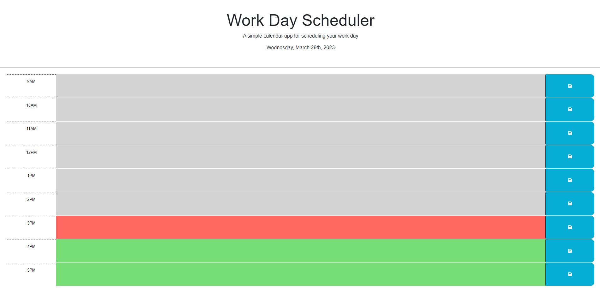

# Work Day Scheduler

## User story

AS AN employee with a busy schedule
I WANT to add important events to a daily planner
SO THAT I can manage my time effectively

## Usage

The current date is displayed at top of page. 
As you scroll down you are able to type and save into said boxes with the save being to the side. 
The color of each time block is color-coded to indicate whether it is past, present, or future. 

## Credits

***Jacqueline Martinez*** https://github.com/JackieAmartinez 
***M Vincent Richards*** https://github.com/vrich88 
***Matt Montiel*** https://github.com/MatthewMontiel 

## License

*See license in Repo*